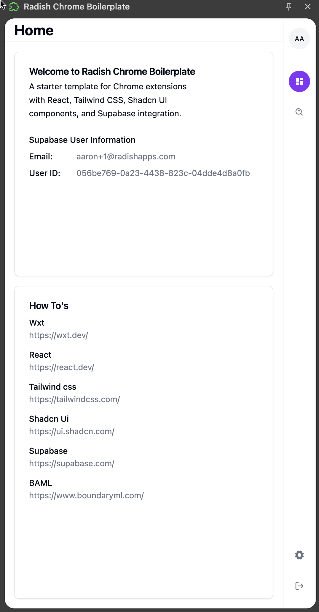
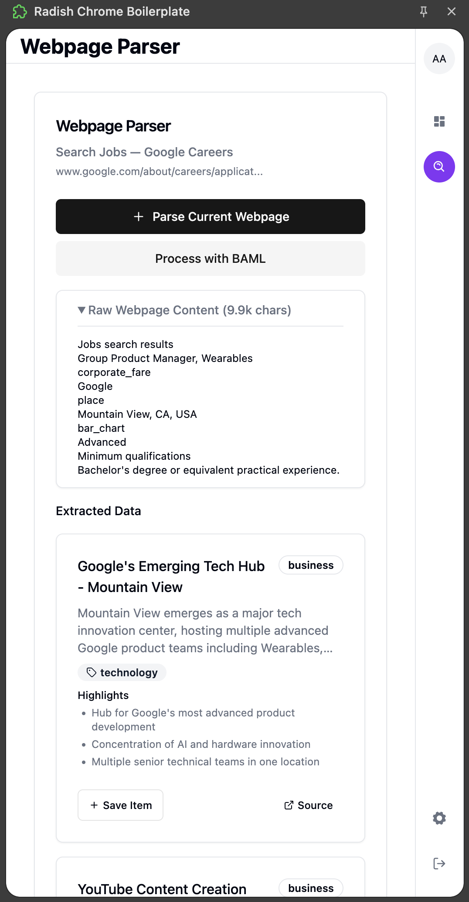

<p align="center">
   <video src="demo/demo.mp4"></video>
  
  
</p>
<p align="center">
  <em>This is a boilerplate and starter for Chrome browser extension, built with Wxt、 React、 Tailwind css 、Shadcn ui and Typescript.
Support dark mode, localization, and Supabase authentication </em>
</p>
<p align="center">
    
      <a href="#"></a>
  <a href="#"></a>
</p>

---

## 🔐 Prerequisites 

Before you get started, please make sure you have the following installed:

- An editor of your choice. For example, webstorm,[Visual Studio Code (VS Code)](https://code.visualstudio.com/download)
- [Node.js](https://nodejs.org/en/download)
- [Git](https://git-scm.com/downloads)
- [pnpm](https://pnpm.io/installation) - we use pnpm as our package manager

## 🗂️ Getting Started

1. **Clone the repository**
   ```bash
   git clone https://github.com/radishapps/chrome-extension-with-react-shadcn-tailwind-supabase.git
   cd your-repo-name
   ```

2. **Install dependencies**
   ```bash
   pnpm install
   ```

3. **Configure environment variables**
   - Copy the example environment file:
   ```bash
   cp apps/extension-ichigo/.env.example apps/extension-ichigo/.env
   ```
   - Edit the `.env` file with your configuration:

   | Variable | Description |
   |----------|-------------|
   | VITE_SUPABASE_URL | Your Supabase project URL (e.g., https://your-project.supabase.co) |
   | VITE_SUPABASE_ANON_KEY | Your Supabase project anonymous key |
   | VITE_JWT_EXPIRY | Token expiry time in seconds (default: 3600) |
   | VITE_API_BASE_URL | URL for the backend API (e.g., http://localhost:3000/api/v1) |

4. **Build the extension**
   ```bash
   pnpm run build
   ```

5. **Install in Chrome**
   - Open Chrome and go to `chrome://extensions/`
   - Enable "Developer mode" (toggle in the top right)
   - Click "Load unpacked" and browse to the extension folder on your local machine
   - Note your extension ID from the extension details or from the URL bar after clicking on extension details. You'll need this to setup the supabase URL configuration to allow authentication from the extension.

6. **Configure Supabase Auth**
   - Go to your Supabase dashboard > Authentication > URL Configuration
   - Add your extension URL to the allowed redirect URLs:
     ```
     chrome-extension://YOUR_EXTENSION_ID/google-auth.html
     ```
     Replace `YOUR_EXTENSION_ID` with the ID from the previous step (e.g., `chrome-extension://ncdfagjflmheejeodkbcljmmdmcicjcj/google-auth.html`)

## 🛠️ Development Workflow

### Running in Development Mode

```bash
# Start the development server
pnpm run dev
```

This command:
- Starts the WXT development server
- Watches for file changes and rebuilds automatically
- Enables hot module reloading for faster development

After starting the dev server, a browser window will popup with the extension already loaded. You may need to open the extension manager and enable developer mode.

### Tips for Chrome Extension Debugging

1. **Inspect Extension Pages**
   - Right-click on the extension icon and select "Inspect Popup" to open DevTools for the popup
   - For sidepanel, right-click inside the panel and choose "Inspect" 
   - For background scripts, go to the extension details page in `chrome://extensions/` and click "background page" link

2. **Reload Extension**
   - During development, the extension should hotreload when you make code changes and save, but you can also click the refresh icon on your extension card in `chrome://extensions/` to reload the extension
   - Use keyboard shortcut Ctrl+R (Windows/Linux) or Cmd+R (Mac) in the DevTools window to reload the current view

3. **Content Script Debugging**
   - Open DevTools on the page where your content script runs
   - Navigate to the "Sources" tab
   - Look for your extension's content scripts under "Content scripts" or "chrome-extension://"

4. **Viewing Logs**
   - Background script logs appear in the DevTools console for the background page
   - Popup and sidepanel logs appear in their respective DevTools consoles
   - Content script logs appear in the DevTools console of the web page where they run

5. **Extension Storage**
   - View and modify extension storage data in DevTools
   - Go to the "Application" tab → "Storage" → "Extension Storage"

Remember that when you make changes during development:
- UI changes (popup, sidepanel) typically update automatically thanks to HMR
- Background script changes may require extension reload
- Content script changes usually require a page reload

## 🚀 Building for Production

```bash
# Build for production
pnpm run build

# Pack the extension
pnpm run pack
```

The `pack` command will create a `.zip` file in the `dist` directory that you can upload to the Chrome Web Store.
